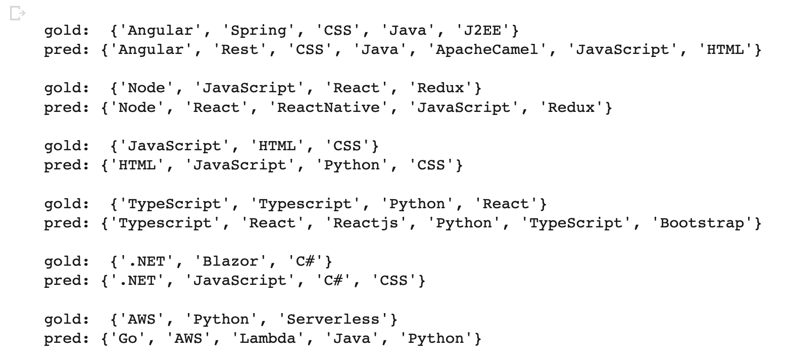
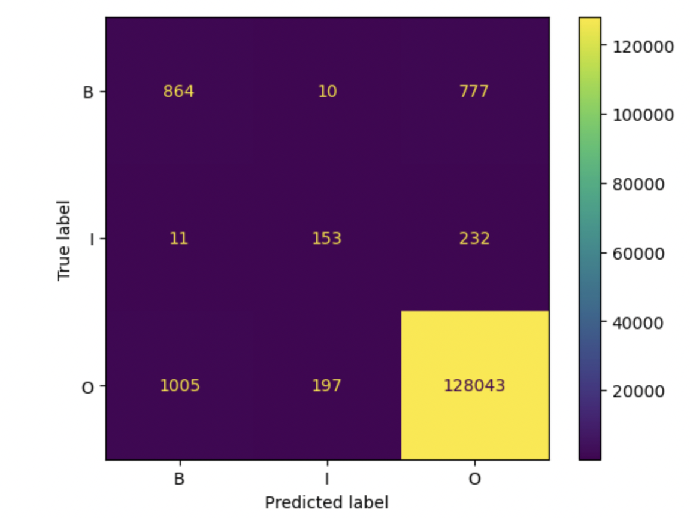
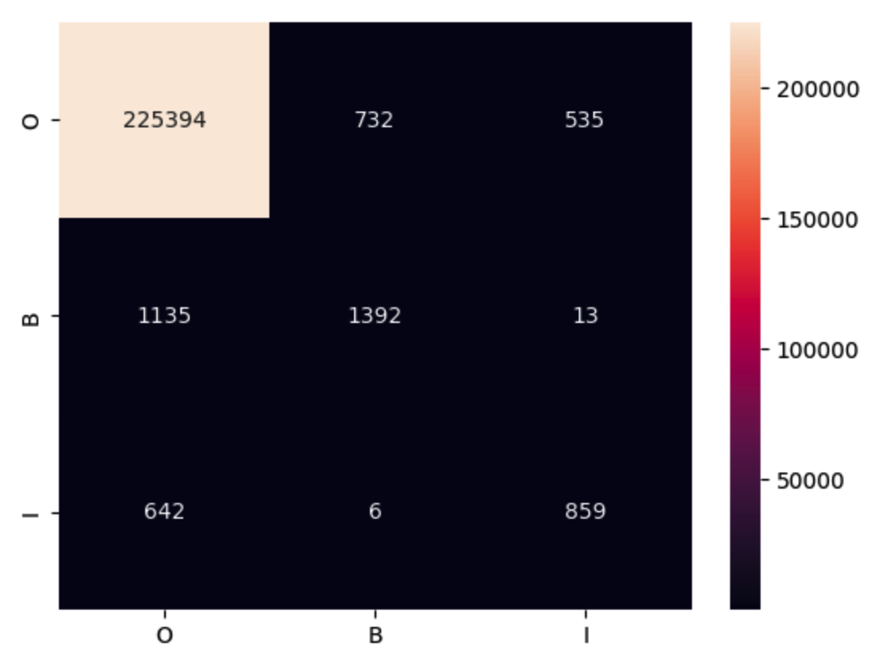
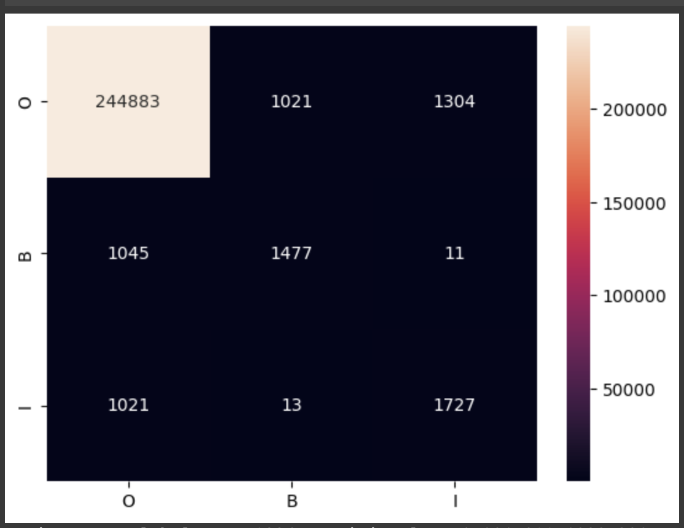

# Project Report

##  Abstract

This project aims to explore a novel approach to model distillation, where smaller models like LSTM, BERT and T5 are trained using data generated by the GPT-3 API for the specific task of identifying skill entities from job descriptions. The goal is to leverage the language modeling capabilities of GPT-3 to generate high-quality data and use it to train smaller models that can perform well in this task. By doing so, we aim to develop more efficient and effective models that can be easily deployed and scaled in the field of human resources. The project will involve experimenting with different data generation techniques and model architectures, as well as evaluating the performance of the distilled models on this task. Ultimately, the goal is to develop a more efficient and scalable approach to model distillation that can be applied to a wide range of natural language processing tasks, including the identification of skill entities from job descriptions.

##  Introduction

In this project, we use the dataset generated previously in COLX 523. This is a dataset of job descriptions. Our task is to create models to extract the skills required from each job description. We take the unlabeled data, and use a GPT model to label it. Then, we use this synthetic dataset to train a few other models. We are implementing the concept of distillation this way. We then evaluate our models. We selected a wide range of models, from less complex to highly complex. We have to take into account that the task is not fully objective as different people have different definitions of skills, hence, it might be tricky to evaluate the models based on the scores alone.

##  Related Work

In our investigation of relevant literature for our project, we came across several noteworthy papers.

- Our primary paper was "Skill Extraction from Job Postings Using Weak Supervision" (2022) by Zhang et al. described a skill extraction method that used Semi-Supervised Learning for this task. The paper's References were a key resource in finding other related works.

- One such paper is "Retrieving Skills from Job Descriptions: A Language Model Based Extreme Multi-label Classification Framework" (2020) by Bhola et al. This work proposes an innovative language model-based approach to skill extraction from job descriptions through extreme multi-label classification. The authors fine-tune pre-trained language models on a large dataset of job descriptions and evaluate their method through experiments against baseline methods.

- Another interesting paper is "Occupational skills extraction with FinBERT" (2020) by Mariia Chernova, which introduces a new method for extracting occupational skills from financial job postings using the FinBERT language model. The authors evaluate their approach through experiments and compare it to baseline methods.

- Additionally, "Salience and Market-aware Skill Extraction for Job Targeting" (2020) by Shi et al. proposes a novel salience-aware attention mechanism for extracting relevant skills from job postings. The paper also introduces an interesting market-aware weighting method that recognizes the varying importance of certain skills in different job markets.

- Furthermore, "Deep Job Understanding at LinkedIn" (2020) by Li et al. presents a comprehensive approach to job recommendation through a Job Understanding system developed by LinkedIn. The system incorporates deep learning models, natural language processing, and graph-based algorithms to provide personalized job recommendations to LinkedIn users.

- Finally, "SpanBERT: Improving Pre-training by Representing and Predicting Spans" (2020) by Joshi et al. presents the SpanBERT language model, which extends the BERT model by capturing span representations in text. The authors introduce a new training objective to encourage the model to predict spans of text rather than individual tokens, and evaluate its effectiveness against other state-of-the-art models. The paper presents a novel approach to language modeling and provides valuable insights into the importance of span representations in text.

Our approach used the underlying principles demonstrated in the above works and used a novel, distillation-based method to perform skill extraction by first creating a synthetic dataset using GPT-3's Curie model after some basic prompt engineering to find the ideal prompt that makes the model perform the task we want. This data is then cleaned, after which it is used to train 5 different models to ultimately create a smaller, less expensive model to perform as well as the parent model, GPT-3.

##  Dataset(s)

In this project, we utilized job postings data from a previous 523 project owned by Jaskirat Benipal, Sai Charan and their teammates in the previous 523 project. The dataset consisted of 2,246 job postings, each containing information such as the URL, job title, job description, seniority level, and employment type. Our first objective was to extract the required skills from the job descriptions using the GPT-3 text-curie-001 model.

Upon analyzing the job descriptions, we observed that the average token length was approximately 560, indicating that the job descriptions were relatively long. This prompted us to leverage the power of GPT-3 to extract the skills required for each job. The model successfully extracted a total of 3,761 unique skills.

However, we encountered challenges with the extracted skills, as the model made several mistakes and included non-skill-related information. Some examples of erroneously extracted skills included terms such as "full-time," "100," and "$". Furthermore, the model occasionally produced skills in incorrect formats, such as "Pandas / Pytorch /" instead of separate skills like "Pandas" and "Pytorch."

To address these issues, our team decided to perform data cleaning on the extracted skills. Each team member was assigned approximately 750 skills for data cleaning purposes. During this process, we focused on removing incorrect skills like "full-time," "100," and "$". Additionally, we ensured that the skills were in the appropriate format by making necessary adjustments. For instance, we transformed "Pandas / Pytorch /" into separate skills, namely "Pandas" and "Pytorch."

After completing the data cleaning phase, we obtained a final set of 1,933 unique skills that accurately represent the required skills from the job descriptions. These skills underwent a meticulous cleaning process, enhancing the overall quality and usability of the extracted data.

##  Methods

[*DistilBERT model:*](code/DistilBERT_base_cased.ipynb)

This was the least complex BERT based model that we implemented. We expected it to run the fastest and have a lower score relative to the other BERT based models. We received a F1 score of 0.370 with the DistilBERT model. We had used the auto-tokenizer for this model and the other 2 BERT models as well. We did not expect this model to perform any better as it is designed to be a lightweight model that is not as complex as the other models. Hence, it performs worse than the other 2 BERT models.

[*BERT model:*](code/BERT_base_cased.ipynb)

We then used the default BERT model. We expected this model to outperform the DistilBERT model, but to under perform the RoBERTa model. We had issues with tokenization while implementing all 3 of the BERT models. We proceeded with the auto tokenizer for this one as well. We received an F1 score of 0.451 with the BERT model. This is aligned with our expectations as it outperforms the DistilBERT model and under performs the RoBERTa model.

[*LSTM model:*](code/LSTM.ipynb)
 
We used a single layer, bidirectional LSTM model with embedding size of 75 and hidden dimension size of 50. We trained the model for 20 epochs as we noticed that the "dev set" macro f1 score reaches a saturation point at 20 epochs. The f1 score for the skill recognition task is 0.44 and the macro f1 score for the tag classification task is 0.63.

[*Flan T5 model:*](code/T5Flan_QA.ipynb)

We used a sequence-to-sequence language model with the google/flan-t5-small checkpoint. We set the maximum input length to 128 and maximum target length to 64. The training data was preprocessed with the Flan T5 tokenizer using the preprocess_data function. We used Seq2SeqTrainer from the Hugging Face library for training with the following hyperparameters: batch size of 2, evaluation strategy of "steps" with evaluation every 1000 steps, logging strategy of "steps" with logging every 1 step, saving strategy of "steps" with saving every 1000 steps, learning rate of 4e-3, weight decay of 0.01, and 5 training epochs. During training, we used BLEU score to evaluate the model's progress because our outputs are token sequences and even partial matches can be valuable.

To evaluate the model, we used the evaluate function which computed the precision, recall, and f1-score for the predicted skills against the gold standard skills. The function first converted the 'skills' and 'predicted_skills' columns to sets, then iterated through the sets to compute the true positive, gold count, and predicted count for each example. The precision, recall, and f1-score were then computed from these counts.

[*RoBERTa model:*](code/RoBERTa.ipynb)

The RoBERTa model performs better than the DistilBERT model and the BERT model. The F1 score is around 0.473. In the RoBERTa mode, the AutoTokenizer.from\_pretrained function is utilized to load a tokenizer from the Hugging Face model hub. In this instance, the tokenizer for "roberta-base" is loaded with the add\_prefix\_space=True parameter, which handles situations where a leading space is required before each input example in the language model. For token classification tasks, the DataCollatorForTokenClassification class is employed to gather and preprocess the data. It takes the tokenizer as input to manage the tokenization and padding of input sequences. To load a pre-trained model for token classification, the AutoModelForTokenClassification.from\_pretrained method is used. In this scenario, the "roberta-base" model is loaded with the num\_labels=3 parameter, indicating the number of labels (classes) in the token classification task. Additionally, id2label and label2id mappings are required to convert between label indices and their corresponding string labels. The TrainingArguments class is responsible for defining the training arguments and hyperparameters. It encompasses various settings such as the output directory for saving the trained model, learning rate = 2e-5, per\_device\_train\_batch\_size and per\_device\_eval\_batch\_size are set to 4, weight\_decay is set to 0.01. The load\_best\_model\_at\_end parameter is set to True to load the best model at the end of training. The number of epochs, as specified in the TrainingArguments, is set to 2. This means that the training process will iterate over the entire training dataset twice.

##  Experiments

For the LSTM model, we tried to use additional features like is\_lower (if the token is lowercase), is\_title (if only the first alphabet of the token is uppercase) etc., but these did not improve the results. This was our baseline model, we improved on this model by using BERT and RoBERTa models. The detailed results that we got with these models are listed below and the detailed hyper-parameters used for these models are mentioned above.

##  Results

To avoid the confusion, it is important to note that we can evaluate our models on two separate tasks, tag classification and skill recognition. The table below is for the skill recognition task. Our models were evaluated based on Precision, Recall, and F1 score, which measure the accuracy of the model in identifying relevant skills from job descriptions. We trained five different models, including LSTM, RoBERTa, Flan-t5-base, BERT, and DistilBERT. Based on the results, the RoBERTa model outperformed the other models with an F1 score of 0.473, followed by BERT with F1 score of 0.45. The LSTM and Flan-t5-base models also performed well with F1 scores of 0.447 and 0.32, respectively.

| **Model** | **Precision** | **Recall** | **F1 Score** |
| --- | --- | --- | --- |
| RoBERTa | 0.568 | 0.405 | 0.473 |
| BERT | 0.504 | 0.408 | 0.451 |
| LSTM | 0.411 | 0.489 | 0.447 |
| DistilBERT | 0.487 | 0.298 | 0.370 |
| Flan-t5-base | 0.39 | 0.28 | 0.32 |

The results obtained in our project are a function of various factors such as the size of the dataset, network architectures used, and the experimental conditions applied. For instance, the use of a relatively small dataset of 2,246 job postings may have impacted the performance of our models..The size of the dataset may have limited the amount of training data available to the models, leading to suboptimal performance. Additionally, the use of different network architectures such as LSTM, RoBERTa, Flan-t5-base, BERT, and DistilBERT may have impacted the performance of our models. These architectures have varying complexities, and some may be better suited for the task of skill extraction than others.

Furthermore, the experimental conditions applied, such as data cleaning and tokenization, may have also impacted the performance of our models. In our project, we performed data cleaning to remove erroneous and non-skill related information from the extracted data. This process helped to enhance the quality and accuracy of the data, which may have improved the performance of our models. However, the tokenization process for the BERT-based models was not optimal, which may have led to their poor performance.

In addition to these factors, other experimental conditions such as the use of pre-training word vectors, data augmentation, and hyperparameter tuning may also impact the performance of machine learning models. These conditions can significantly improve model performance and help achieve better results.

We used GPT-3 to label the data, so this data is not perfect and cannot be considered as gold data. As you can see our model performs quite well, but there are some skills which were missed by the GPT-3 model, but are captured by our models (RoBERTa in particular). So we might be getting slightly worse results on the metrics and this might not be a good indicator of our model performance.

Overall, the results obtained in our project are a function of various factors, and optimizing these factors can help improve the performance of our models.

Confusion matrix for their IBO tags(LSTM):

Confusion matrix for their IBO tags (RoBERTa):

Confusion matrix for their IBO tags (BERT):

##  Conclusion

The future scope of this project is vast and can benefit the recruitment industry in many ways. This includes categorizing the extracted skills into different categories, expanding the scope beyond recruitment to other industries and domains, improving the accuracy of the model, and creating an interactive user interface. These future directions can enhance the usefulness of our model and provide valuable insights to help organizations automate the process of extracting skills from job descriptions.
